# Object-Detection-in-an-Urban-Environment-udacity
First project of self driving car nanodegree program by udacity: [original repository](https://github.com/udacity/nd013-c1-vision-starter)

## Instructions

### Local Setup

For local setup if you have your own Nvidia GPU, you can use the provided Dockerfile and requirements in the build directory.

Follow the README therein to create a docker container and install all prerequisites.

I'm also providing a conda environment to install the needed dependecies, if you don't prefer to work with docker image: `conda env create -f environment.yml`

### Download and process the Data

For this project, we will be using data from the [Waymo Open dataset](https://waymo.com/open/).

The files can be downloaded directly from the website as tar files or from the [Google Cloud Bucket](https://console.cloud.google.com/storage/browser/waymo_open_dataset_v_1_2_0_individual_files/) as individual tf records. <br>
Please note that we only need a subset of the data provided (for example, we do not need to use the Lidar data). Therefore, we are going to download and trim immediately each file. In download_process.py, you can view the create_tf_example function, which will perform this processing. This function takes the components of a Waymo Tf record and saves them in the Tf Object Detection api format. An example of such function is described here. We are already providing the label_map.pbtxt file.

You can run the script using the following command:
```
python download_process.py --data_dir {processed_file_location} --size {number of files you want to download}
```
PS: if you're a udacity student and have access to their workspace, you can download directly the processed files from the workspace. 

### Exploratory Data Analysis

After downloading the data, It's time to explore it. You can check the `Exploratory Data Analysis` notebook for more details. <br>
These are 10 random images from the dataset with their associated bounding boxes 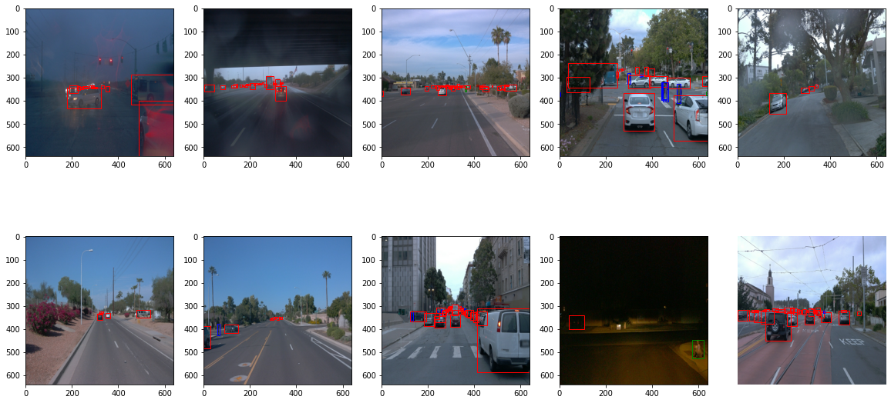 <br>
We've also checked the data distribution. And from this histogram we can see that labels are not equaly distributed <br> 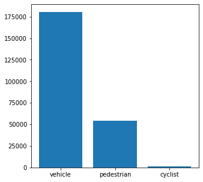

### Create the training - validation splits

It's time to split our data between training, validation and test sets. Based on the analysis we did, a split of 80%, 10%, 10% seems to be suitable of this problem. <br>
You can do so, by executing the script below. <br>
```
python create_splits.py --source {source data directory} --destination {destination data directory}
```
PS: Proportions of split are configurable by changing `TRAIN_VAL_TEST_PROP` constant in the script to be executed.

### Edit the config file

For training, we'll be using the Tf Object Detection API which relies on **config files**. The config that we will use for this project is `pipeline.config`, which is the config for a SSD Resnet 50 640x640 model. You can learn more about the Single Shot Detector [here](https://arxiv.org/pdf/1512.02325.pdf).

First, let's download the [pretrained model](http://download.tensorflow.org/models/object_detection/tf2/20200711/ssd_resnet50_v1_fpn_640x640_coco17_tpu-8.tar.gz) and move it to `experiments/pretrained_model/`.

We need to edit the config files to change the location of the training and validation files, as well as the location of the label_map file, pretrained weights. We also need to adjust the batch size. To do so, run the following:
```
python edit_config.py --train_dir {path of training directory} --eval_dir {path of validation directory} --batch_size 2 --checkpoint experiments/pretrained-models/ssd_resnet50_v1_fpn_640x640_coco17_tpu-8/checkpoint/ckpt-0 --label_map experiments/label_map.pbtxt
```
A new config file has been created, `pipeline_new.config`.

### Training

Time to launch our first experiment: <br>
* Training process:
```
python experiments/model_main_tf2.py --model_dir=experiments/reference/ --pipeline_config_path=experiments/reference/pipeline_new.config
```
Once the training is finished, launch the evaluation process:
* Evaluation process:
```
python experiments/model_main_tf2.py --model_dir=experiments/reference/ --pipeline_config_path=experiments/reference/pipeline_new.config --checkpoint_dir=experiments/reference/
```
Results can be visualized in tensorboard
```
tensorboard --logdir experiments/reference
```
This is a glimpse on the results we had, after our first exepriment: <br>
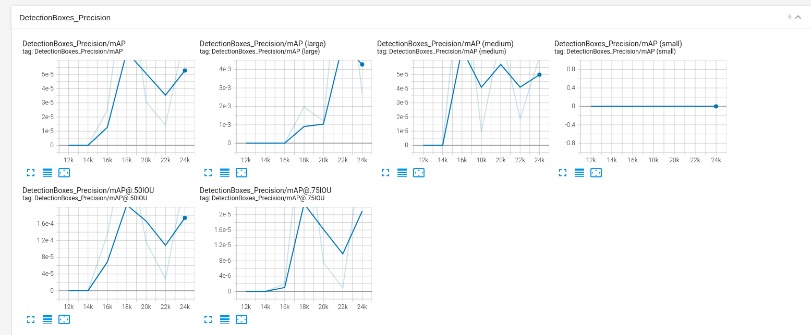
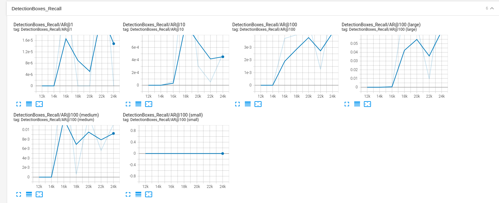
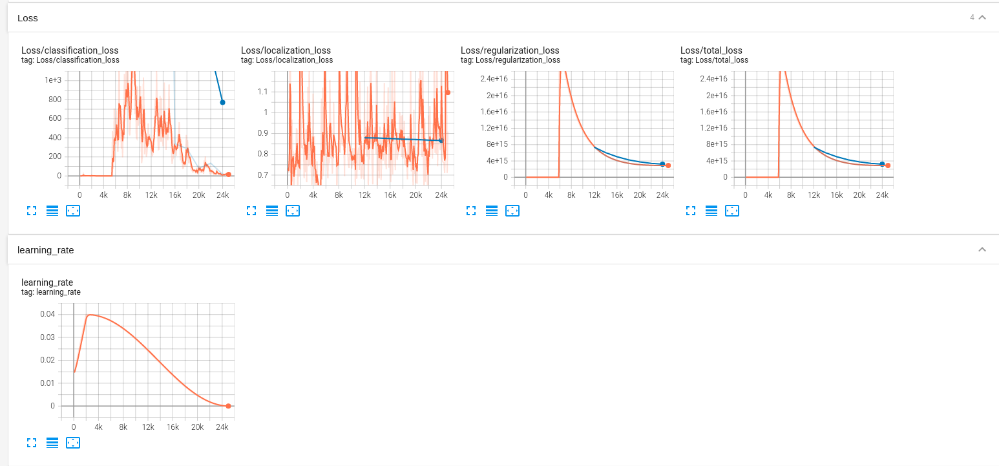 <br>
It's clear that the training didn't go well since the loss curves are really high. Precision and recall metrics are not great either. Some improvements need to be done.

### Improve the performances
#### Data augmentation
One obvious change consists in improving the data augmentation strategy. You can check `experiments/augmentation/pipeline_new.config` file where we specified the different data augmentation operations to be done <br>
What we had already in the first training
- random horizontal flip
- random crop image <br>

New augmentations
- random rgb to gray: The model will normally better recognize objects in dark zones 
- random adjust brightness: This can enhance the object recognition in daylight or in the night in torch light
- random adjust contrast: More robustness with dark images
- random distort color: Better recognition of cars with different colors <br>

In this notebook `Explore augmentations.ipynb` we're exploring the data augmentation and displaying some examples: <br>
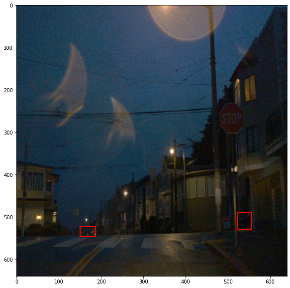

Let's share the results of the new training done with these additional augmentations <br>
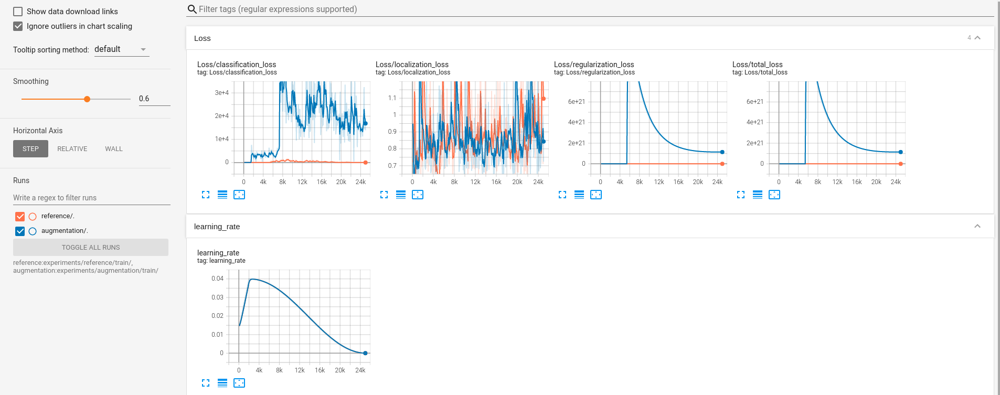

Loss values are again exploding and seems that data augmentation is not the only part that we need to think about. 

#### Bigger batch size
The batch size used was too small and that can block the model from reaching a decent performance that why we thought about doubling the batch size from `2` to `4`. And now results turned out to be way better than what we got before. <br>
By the way, we kept the same augmentation operation from the previous section, in the new training done with bigger batch size. You can check the final config file `experiments/augmentation/pipeline_new.config`. <br>
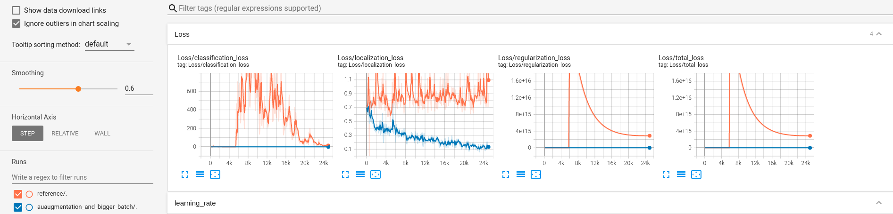 <br>
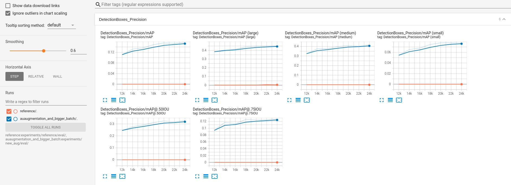 <br>
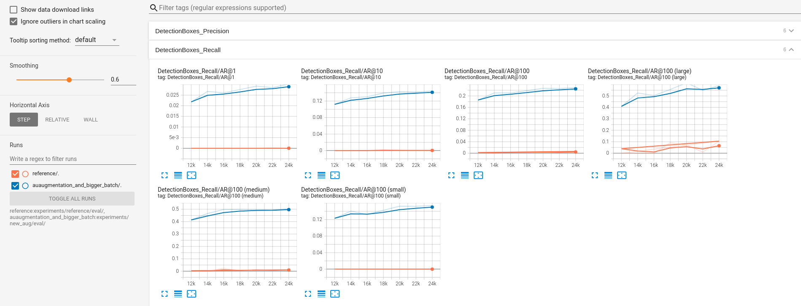 <br>
It's clear from the comparison above that using a bigger batch size was really helpful for the model to learn. <br>
Since the scale of loss values is different between the two runs, we can't even see how the curves of the new run were decreasing. So, let's see the new run curves alone. <br>
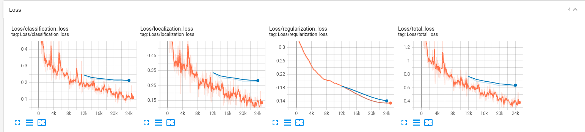 <br>
Although this run showed better results than the two previous ones, it's clear, by comparing training and evaluation curves, that we have some overfitting.

### Creating an animation

At the end we can export the trained model and do some rollouts with it. You can check the animation video shared in this repository or create your own by running the following commands. <br>
* Export the trained model:
```
python experiments/exporter_main_v2.py --input_type image_tensor --pipeline_config_path {path of pipeline_new.config file} --trained_checkpoint_dir {path of the directory where checkpoints were saved} --output_directory {path of the directory where the model will be exported}
```
* Create a video rollout:
```
python inference_video.py --labelmap_path label_map.pbtxt --model_path {dir where model was exported} --tf_record_path {path of one tfrecord file from test set} --config_path {path of pipeline_new.config file} --output_path animation.gif
```
